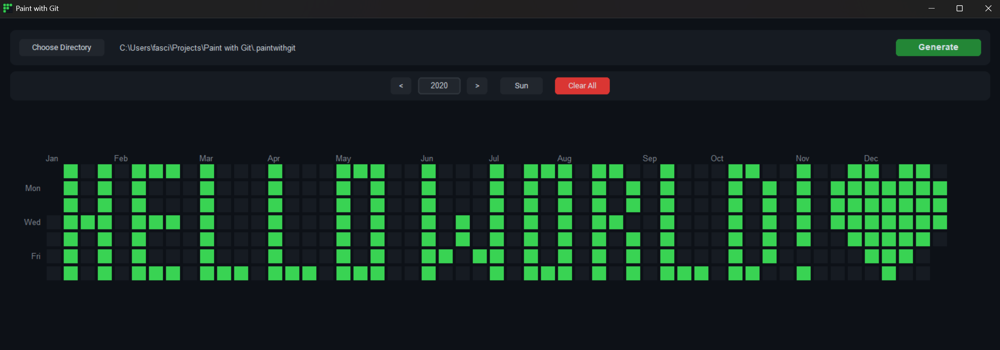
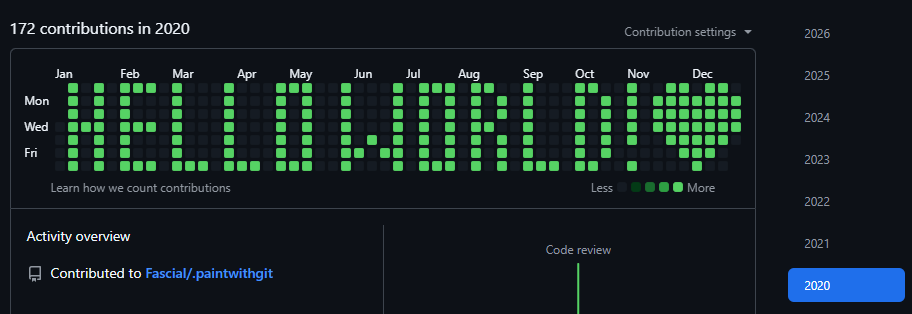

#  Paint with Git

Draw pixel art on your GitHub contribution graph.

Pick a year, paint your design on the grid, hit **Generate**, and push the result to GitHub. Your profile will display your artwork.

<p align="center">
  
</p>

---

## Quick Start

**Prerequisites:** [Python 3.7+](https://www.python.org/downloads/) and [Git](https://git-scm.com/downloads).

Git must be configured with your identity:

```bash
git config --global user.name "Your Name"
git config --global user.email "you@example.com"
```

On windows

```bash
.\run.bat
```

On Linux / macOS

```
chmod +x run.sh && ./run.sh
```

The script auto-installs [uv](https://github.com/astral-sh/uv) if needed, syncs dependencies, and launches the app.

---

## Usage

### Draw

| Action          | Input                                |
| --------------- | ------------------------------------ |
| Paint a cell    | Left-click or drag                   |
| Erase a cell    | Right-click or drag                  |
| Switch year     | < > arrows or type in the year field |
| Wipe the canvas | Click **Clear All**                  |

### Generate

Click **Generate**. The app creates a `.paintwithgit/` folder containing a Git repo with empty commits matching your drawing. An `[OK]` status appears when done.

### Upload to GitHub

1. Create a new repo on GitHub (private recommended).
2. In the `.paintwithgit/` folder, run:

```bash
git remote add origin https://github.com/<you>/<repo>.git
git push -f origin main
```

3. Check your GitHub profile - your art is on the graph.

<p align="center">
  
</p>

> The remote is saved locally. Future updates only need `git push -f origin main`.

### Updating

Edit your drawing, click **Generate**, then run `git push -f origin main`.

To remove it from GitHub, delete the repo.

---

## Project Structure

```
Paint with Git/
├── src/
│   ├── ui.py              # Application GUI
│   ├── components.py      # Custom UI components
│   ├── config.py          # State and constants
│   └── git_processor.py   # Fast-import commit engine
├── assets/                # Images & icons
├── run.bat                # Windows launcher
├── run.sh                 # Linux/macOS launcher
└── pyproject.toml         # Dependencies
```
